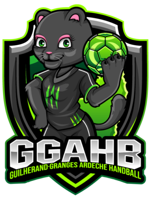

# handball-project
 Projet SAE semestre 4

## Installation

    To install the project, you need to have a web server (Apache, Nginx, etc.) and a database (MySQL, MariaDB, etc.). 
    You also need to have PHP 7.2 or higher installed on your computer.
    You need to have Composer installed on your computer.
    You need to have Node.js installed on your computer.

### 1. Clone the project

    1. Clone the project on your computer.
    2. Open a terminal in the project folder.
    3. Run the command "composer install" to install the dependencies.
    4. Run the command "cd public" and after, run "npm install" to install the dependencies.
    5. Run the command "cd .." to go back to the project folder.
    6. Run the command "symfony console doctrine:database:create" to create the database.
    7. Run the command "symfony console doctrine:migrations:migrate" to create the tables.
    8. Run the command "symfony console doctrine:fixtures:load" to load the fixtures.
    9. Run the command "symfony server:start" to start the server.
    10. Open your browser and go to the address "http://

### 2. Project structure

    The project is structured as follows:
    - config/ contains the configuration files of the project.
    - public/ contains the public files of the project.
    - src/ contains the source files of the project.
    - templates/ contains the templates of the project.
    - tests/ contains the tests of the project.
    - translations/ contains the translations of the project.
    - var/ contains the cache and the logs of the project.
    - vendor/ contains the dependencies of the project.

### 3. Create the database

Import the [script](sql/script.sql) file into your database.

### 4. Configure the project

Open the file `config/parameters.yml` and configure the database connection.

### 5. Docs

- [Symfony](https://symfony.com/download)
- [Composer](https://getcomposer.org/download/)
- [Node.js](https://nodejs.org/en/download/)

## Authors

- [**Valentin Gelly**](https://github.com/Valentin-Gelly)
- [**Léo Deroin**](https://github.com/achedon12)
- [**Thomas Grosjean**](https://github.com/labigot)
- [**Aurélien Ferrari**](https://github.com/AurelienFerrari)
- [**Antoine Berthillot**](https://github.com/poloine07)